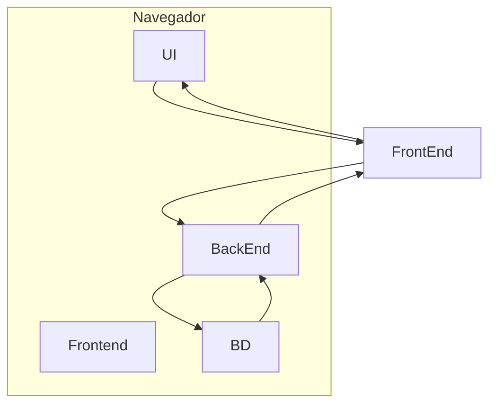

## Cusrso FrontEnd - Prof Diogo 

## Criando um diagrama com Mermind

## Diagrama de Fluxo de arquitetura de Ptojeto

```mermaid
graph TD
    subgraph Cliente["Navegador"]
        UI
    end

    subgraph Cliente["React"]
        Frontend
    end

    subgraph Cliente["API"]
        BackEnd
    end

    subgraph Cliente["MongoDB"]
        BD
    end
    %% fluxo

    UI-->FrontEnd
    FrontEnd-->BackEnd
    BackEnd-->BD
    BD-->BackEnd
    BackEnd-->FrontEnd
    FrontEnd-->UI


```