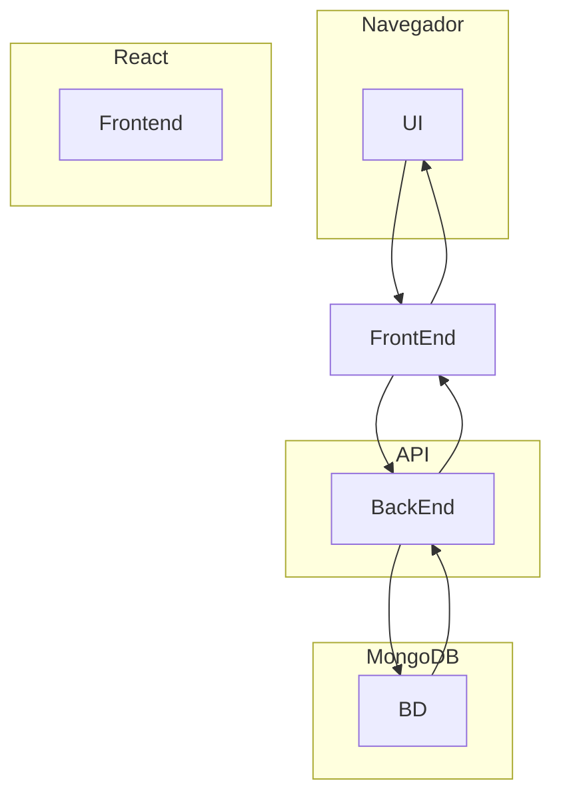
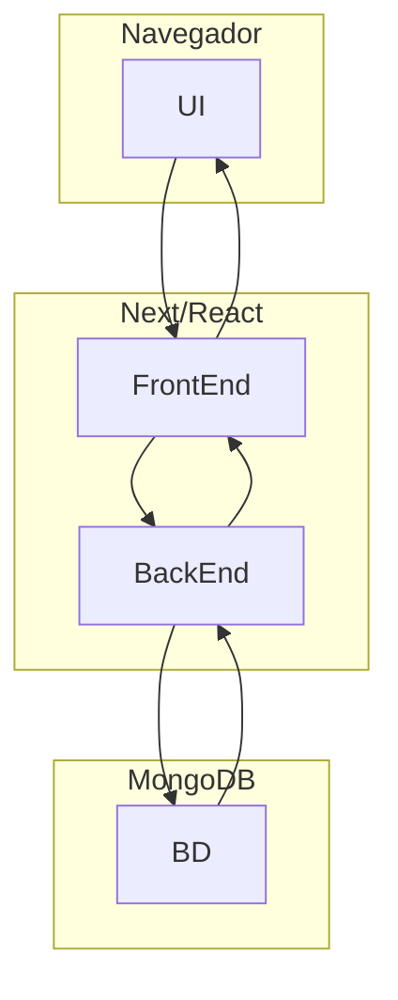

## Cusrso FrontEnd - Prof Diogo 

## Criando um diagrama com Mermind

## Diagrama de Fluxo de arquitetura de Ptojeto

```mermaid
graph TD
    subgraph Cliente["Navegador"]
        UI
    end

    subgraph Front["React"]
        Frontend
    end

    subgraph Back["API"]
        BackEnd
    end

    subgraph Banco["MongoDB"]
        BD
    end

    %% fluxo

    UI-->FrontEnd
    FrontEnd-->BackEnd
    BackEnd-->BD
    BD-->BackEnd
    BackEnd-->FrontEnd
    FrontEnd-->UI


```

### Diagrama de Fluxo de Arquitetura para um Projeto Next

```mermaid 
graph TD
    subgraph Cliente["Navegador"]
        UI
    end
    
    subgraph Front/Back["Next/React"]
        FrontEnd
    
        BackEnd
    end
    
    subgraph Banco["MongoDB"]
        BD
    end

    %% fluxo

    UI-->FrontEnd
    FrontEnd-->BackEnd
    BackEnd-->BD
    BD-->BackEnd
    BackEnd-->FrontEnd
    FrontEnd-->UI
    
```